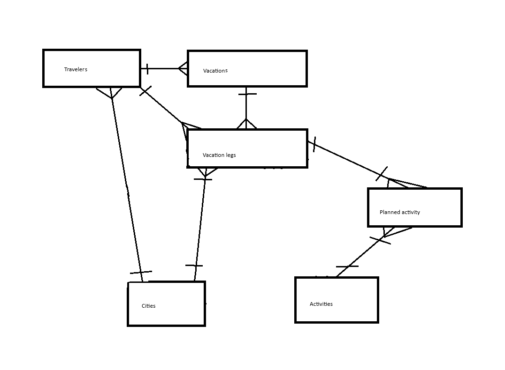
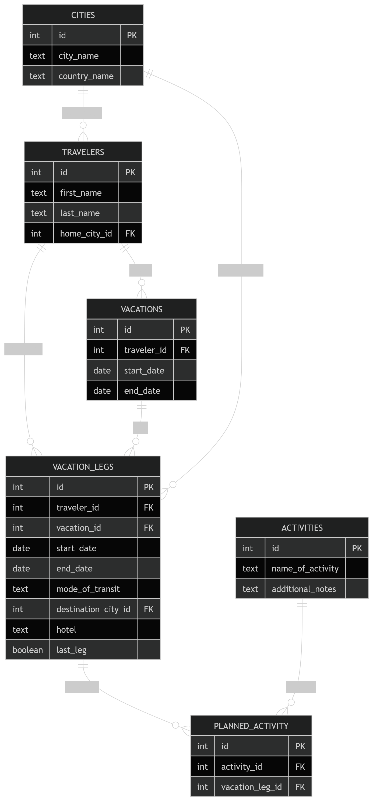

# Design Document

By resonate712

## Scope

The purpose of this database is to simulate the database that a travel agency would have.  A travel agency plans a books vacations for customers.  As a result they would need a database to keep track of the itineraries for customers.  The database is divided into six tables:

- Travelers
- Vacations
- Vacation legs
- Cities
- Activities
- Planned activity

The database does not have transportation listed as a separate table nor does the hotel that was booked have a separate table.  Since these things have a one to one relationship with the leg of the vacation there isn’t an explicit need for them to have separate tables.  If a customer changes hotel within the same city then a new leg of the vacation will be created.  The customer may take a taxi to the new hotel so that would count as transportation and a new leg of the vacation.  The database also includes a queries.sql file that has a selection of sample data as well as some queries that a travel agency might run on such a database.

## Functional Requirements

The user should find it easy to keep track and manage a customer’s vacation as they travel from location to one or more locations.

The database does not include time.  Time could be added at a later point if the developer so chooses, but at this point a date is considered sufficient to show the design of the database.

## Representation

Entities are captured in SQLite tables with the following schema.

CREATE TABLE "travelers" (
    "id" INTEGER,
    "first_name" TEXT NOT NULL,
    "last_name" TEXT NOT NULL,
    "home_city_id" INTEGER NOT NULL,
    PRIMARY KEY("id"),
    FOREIGN KEY("home_city_id") REFERENCES "cities"("id")
);

CREATE TABLE "vacations" (
    "id" INTEGER,
    "traveler_id" INTEGER NOT NULL,
    "start_date" NUMERIC NOT NULL,
    "end_date" NUMERIC NOT NULL,
    PRIMARY KEY("id"),
    FOREIGN KEY("traveler_id") REFERENCES "travelers"("id")
);

CREATE TABLE "vacation_legs" (
    "id" INTEGER,
    "traveler_id" INTEGER NOT NULL,
    "vacation_id" INTEGER NOT NULL,
    "start_date" NUMERIC NOT NULL,
    "end_date" NUMERIC NOT NULL,
    "mode_of_transit" TEXT NOT NULL,
    "destination_city_id" INTEGER NOT NULL,
    "hotel" TEXT,
    "last_leg" INTEGER NOT NULL CHECK ("last_leg" IN (0, 1)),
    PRIMARY KEY("id"),
    FOREIGN KEY("traveler_id") REFERENCES "travelers"("id"),
    FOREIGN KEY("vacation_id") REFERENCES "vacations"("id") ON DELETE CASCADE,
    FOREIGN KEY("destination_city_id") REFERENCES "cities"("id")
);

CREATE TABLE "cities" (
    "id" INTEGER,
    "city_name" TEXT NOT NULL,
    "country_name" TEXT NOT NULL,
    PRIMARY KEY("id")
);

CREATE TABLE "activities" (
    "id" INTEGER,
    "name_of_activity" TEXT NOT NULL,
    "additional_notes" TEXT,
    PRIMARY KEY("id")
);

CREATE TABLE "planned_activity" (
    "id" INTEGER,
    "activity_id" INTEGER NOT NULL,
    "vacation_leg_id" INTEGER NOT NULL,
    PRIMARY KEY("id"),
    FOREIGN KEY("activity_id") REFERENCES "activities"("id"),
    FOREIGN KEY("vacation_leg_id") REFERENCES "vacation_legs"("id") ON DELETE CASCADE
);

### Entities

The entities stated above are further elaborated here:

#### Travelers

The travelers table includes:

- id, which specifies the unique ID for the traveler as an INTEGER. This column has the PRIMARY KEY constraint applied.
- first_name, which specifies the traveler’s first name as TEXT. A NOT NULL constraint ensures a value is always provided.
- last_name, which specifies the traveler’s last name as TEXT. A NOT NULL constraint ensures a value is always provided.
- home_city_id, which specifies the traveler’s home city as an INTEGER. A NOT NULL constraint ensures a value is always provided. This column is a FOREIGN KEY referencing cities(id).
#### Vacations

The vacations table includes:

- id, which specifies the unique ID for the vacation as an INTEGER. This column has the PRIMARY KEY constraint applied.
- traveler_id, which specifies the traveler associated with the vacation as an INTEGER. A NOT NULL constraint ensures a value is always provided. This column is a FOREIGN KEY referencing travelers(id).
- start_date, which specifies the start date of the vacation as NUMERIC. A NOT NULL constraint ensures a value is always provided.
- end_date, which specifies the end date of the vacation as NUMERIC. A NOT NULL constraint ensures a value is always provided.
#### Vacation Legs

The vacation_legs table includes:

- id, which specifies the unique ID for the vacation leg as an INTEGER. This column has the PRIMARY KEY constraint applied.
- traveler_id, which specifies the traveler associated with the leg as an INTEGER. A NOT NULL constraint ensures a value is always provided. This column is a FOREIGN KEY referencing travelers(id).
- vacation_id, which specifies the vacation associated with the leg as an INTEGER. A NOT NULL constraint ensures a value is always provided. This column is a FOREIGN KEY referencing vacations(id) with ON DELETE CASCADE.
- start_date, which specifies the start date of the leg as NUMERIC. A NOT NULL constraint ensures a value is always provided.
- end_date, which specifies the end date of the leg as NUMERIC. A NOT NULL constraint ensures a value is always provided.
- mode_of_transit, which specifies the mode of transportation as TEXT. A NOT NULL constraint ensures a value is always provided.
- destination_city_id, which specifies the destination city as an INTEGER. A NOT NULL constraint ensures a value is always provided. This column is a FOREIGN KEY referencing cities(id).
- hotel, which specifies the hotel name as TEXT. This field is optional.
- last_leg, which indicates whether this is the final leg of the vacation as an INTEGER. A CHECK constraint restricts values to 0 (false) or 1 (true), and a NOT NULL constraint ensures a value is always provided.
#### Cities

The cities table includes:

- id, which specifies the unique ID for the city as an INTEGER. This column has the PRIMARY KEY constraint applied.
- city_name, which specifies the name of the city as TEXT. A NOT NULL constraint ensures a value is always provided.
- country_name, which specifies the name of the country as TEXT. A NOT NULL constraint ensures a value is always provided.
#### Activities

The activities table includes:

- id, which specifies the unique ID for the activity as an INTEGER. This column has the PRIMARY KEY constraint applied.
- name_of_activity, which specifies the name of the activity as TEXT. A NOT NULL constraint ensures a value is always provided.
- additional_notes, which provides optional notes about the activity as TEXT.
#### Planned Activity

The planned_activity table includes:

- id, which specifies the unique ID for the planned activity entry as an INTEGER. This column has the PRIMARY KEY constraint applied.
- activity_id, which specifies the associated activity as an INTEGER. A NOT NULL constraint ensures a value is always provided. This column is a FOREIGN KEY referencing activities(id).
- vacation_leg_id, which specifies the associated vacation leg as an INTEGER. A NOT NULL constraint ensures a value is always provided. This column is a FOREIGN KEY referencing vacation_legs(id) with ON DELETE CASCADE.

### Relationships

See the following diagram for a basic ER diagram of the database:

This was the initial table that the author used to brainstorm the database.

Below is the fully elaborated ER diagram:

The diagram fully explains the relationships between the tables.  To add to the diagram it should be noted that the vacation legs table contains the most data and key constraints.  This table is one of the most crucial points in the database where travelers, cities, and vacations meet.

## Optimizations

The indexes added in the schema file focus in on searches that relate to travelers and vacation legs as this is where customers may be asking the travel agency questions about their travel plans.  For instance, a customer may want to be reminded of all legs of their vacation.

## Limitations

The database has limitations in that it is basic.  However, that does not mean that there are explicit limitations.  One could view this database as a starting point for future features and data.
